<section class="oe_container oe_dark">
    

        

            <h2 class="oe_slogan">Product Import</h2>
            <h3 class="oe_slogan">Import and massive update products</h3>
        

        

            

                
            

        

    

    

        

            

                Add entry <strong>Import Products</strong> in Product menu of <i>Sales</i>, <i>Purchase</i> and <i>Warehouse</i> applications.
                It only can
                be viewed by <i>Sales Manager</i>, <i>Purchase Manager</i> and <i>Warehouse Manager</i>
            

        

            

            

                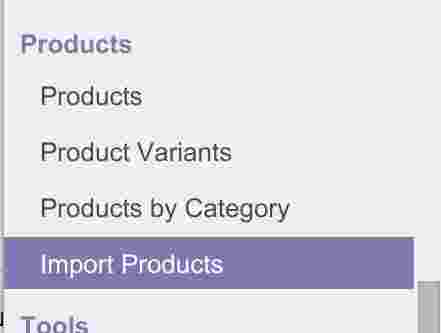
            

        

    

</section>
<section class="oe_container">
    

        

            <h2 class="oe_slogan">How to use it</h2>
        

        

            <ul style="list-style-type:disc">
                <li>Write a <strong>Description.</strong></li>
                <li>
                    <strong>Select</strong> CSV file.
                    

                        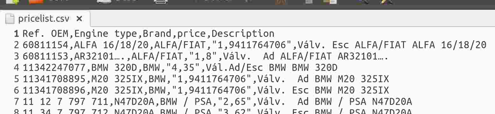
                    

                </li>
                <li>
                    <strong>Load Header</strong> to load the file's first row and populate the mapping fields. Each selection field contains all the titles of the file.
                    

                        
                    

                </li>
                <li>
                    Remap file headers if it's necessary. The <i>Reference</i> field determines if product exists.
                    

                        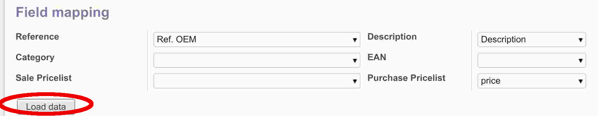
                    

                </li>
                <li>
                    <strong>Load data</strong> to populate the grid below according to mapped fields.
                    

                        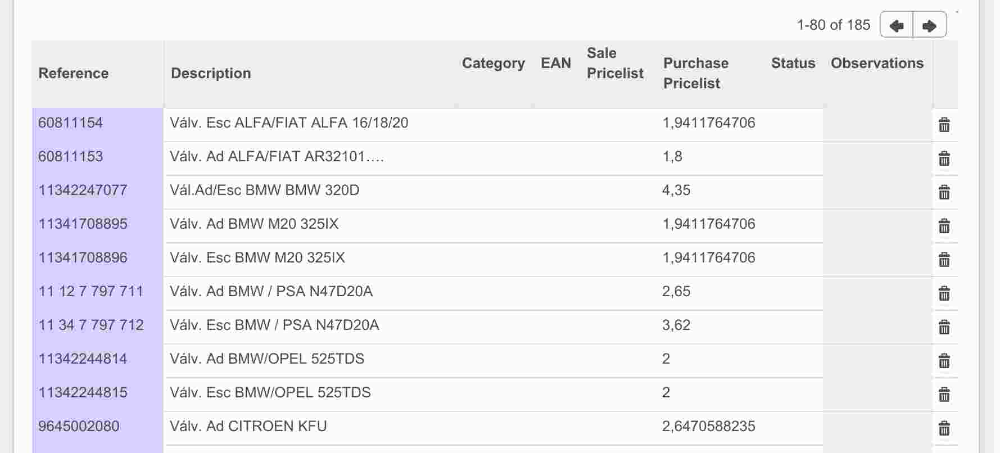
                    

                </li>
                <li>
                    Select the <strong>Supplier</strong> in case you need to update <i>Purchase Pricelist</i> or create products with new <i>Purchase
                        Pricelist</i>.
                    

                        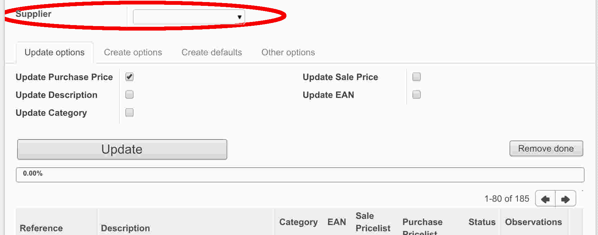
                    

                </li>
                <li>
                    In case the product already exists you can select which field to update in <strong>Update
                        options</strong> tab.
                    

                        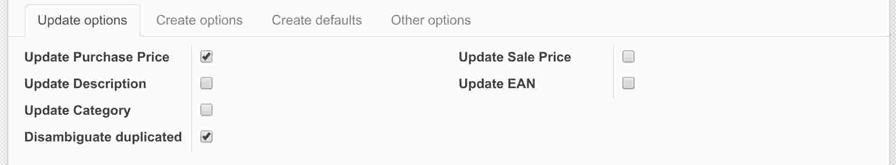
                    

                    If <i>Update Category</i> is selected the <i>Create Category</i> option is enabled. It allows to create a category in case the <i>Product</i> exists but the <i>Category</i> doesn't.
                    

                        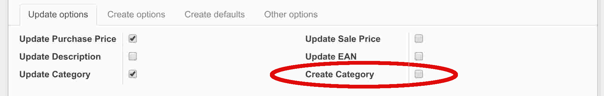
                    

                </li>
                <li>
                    In case the product does not exist you can select if it must be created and how in <strong>Create
                        options</strong> tab.
                    

                        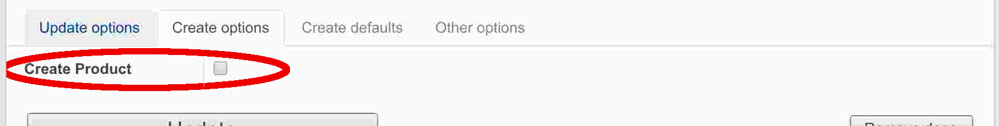
                    

                    <ul>
                        <li><strong>Create Product</strong> allow create product if not exists. When enabled the
                            rest of options are shown.
                            

                                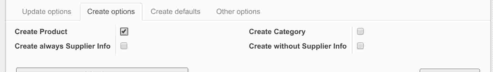
                            

                            <ul>
                                <li><strong>Create Category</strong> Allow create category if not exists.</li>
                                <li><strong>Create always Supplier Info</strong> Allow create product with the
                                    <i>Supplier</i> selected
                                    even if the <i>Purchase Pricelist</i> is not defined.
                                </li>
                                <li><strong>Create without Supplier Info</strong> Allow create product if neither
                                    <i>Supplier</i>
                                    nor <i>Purchase Pricelist</i> are defined.
                                </li>
                            </ul>
                        </li>
                    </ul>
                </li>
                <li>
                    If the product will be created, in the <strong>Creation options</strong> tab you can define default values.
                    

                        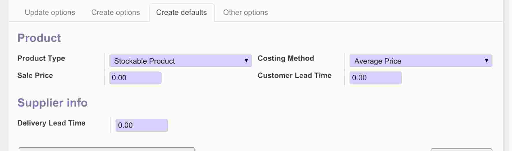
                    

                </li>
                <li>
                    Select file and system options in <strong>Other options</strong> tab.
                    

                        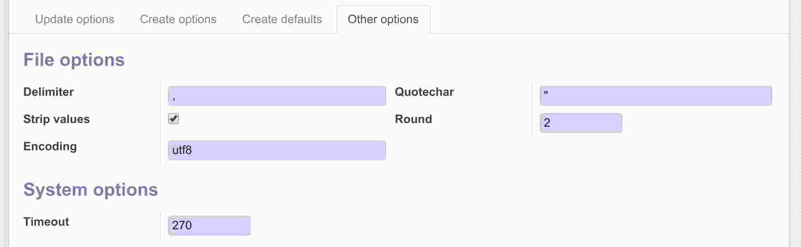
                    

                    <ul>
                        <li><strong>Delimiter</strong> Character used to delimiter fields in CSV file.</li>
                        <li><strong>Quotechar</strong> Character used to quote text fields.</li>
                        <li><strong>Strip values</strong> Remove field leading and trailing spaces.</li>
                        <li><strong>Round</strong> Number of decimals to round <i>Sale Pricelist</i> and <i>Purchase
                            Pricelist.</i></li>
                        <li><strong>Encoding</strong> Define file encoding.</li>
                        <li><strong>Timeout</strong> Avoid reverse proxy or web server timeout. After this number of
                            seconds, the import process will be put on hold and it will be able to continue after
                            error correction and removing done lines.
                        </li>
                    </ul>
                </li>
                <li>
                    Press the <strong>Update</strong> button to start de import process. Maximum execution time is <strong>Timeout</strong> seconds.
                    

                        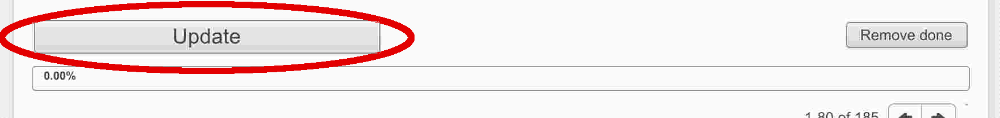
                    

                </li>
                <li>
                    When the import process finish:
                    <ul>
                        <li>Each line will be populad with <strong>Status</strong> of the process for that line
                            (<i>Done</i> or <i>Error</i>) and <strong>Observations</strong> indicating if there was a
                            problem and how to solve it.
                        </li>
                        <li>The progress bar indicates the percentage of import done. In case the
                            <i>Timeout</i> was reached it shows less than 100%.
                        </li>
                    </ul>
                    

                        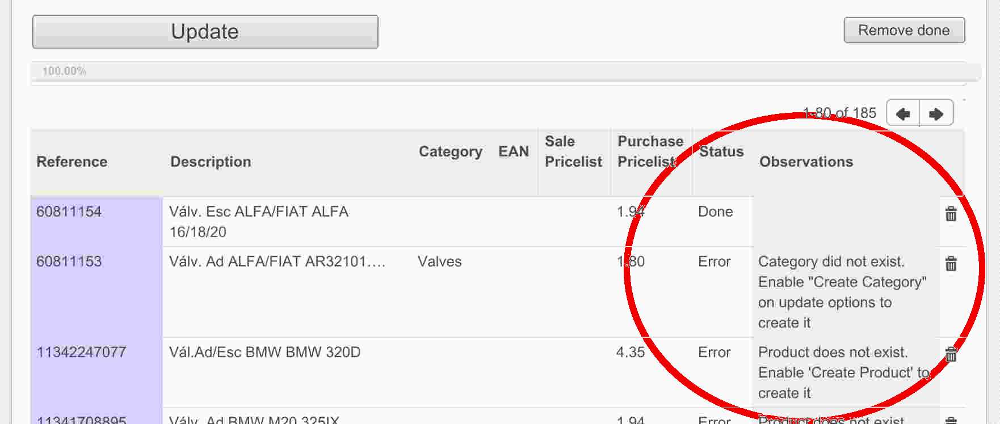
                    

                </li>
                <li>
                    Use <strong>Remove done</strong> button to remove all lines processed successfully (with done status). If there's still errors, modifiy the importing parameters according to the observations and press the <strong>Update</strong> button again. Repeat the process until all errors are gone.
                    

                        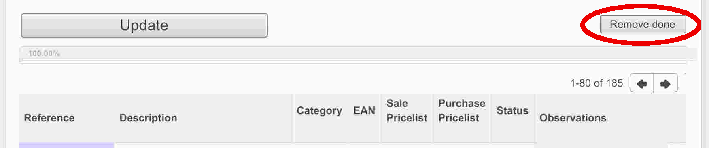
                    

                </li>
            </ul>
        

    

</section>