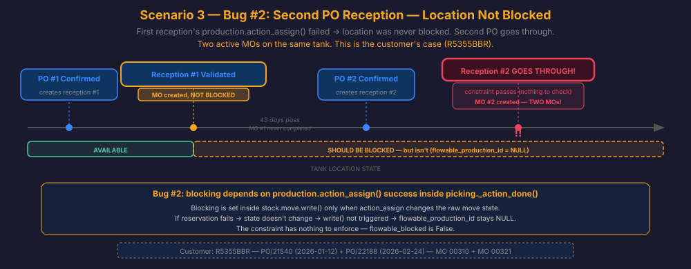

# Flowable Location Blocking Mechanism

This document describes how the blocking mechanism works for flowable locations (tanks),
the complete flow from PO reception to MO creation, the known issues, and the
implemented fixes.

**PR**: https://github.com/nuobit/odoo-addons/pull/847 **Branch**:
`14.0-fix-stock_location_flowable-flowable_blocking`

---

## Flow Diagrams

All diagrams are in `diagrams/`.

### The Physical Reality: Tank Lifecycle

A flowable location is a physical tank. A reception never reserves — it just delivers
stock from a virtual supplier location to the tank. Blocking should happen when stock
enters the tank (reception picking validation), not when the MO internally reserves
quants.


### Scenario 1: First PO Reception — Happy Path

Single PO received at an available tank. MO auto-created, location blocked, MO
completes, location freed. Everything works correctly.


### Scenario 2 — Bug #1: Second PO Reception — Location Blocked but Constraint Bypassed

Location IS blocked. A second PO receives into the same tank. The constraint skips
non-MO moves — the second reception goes through. Two active MOs on the same tank.


### Scenario 3 — Bug #2: Second PO Reception — Location Not Blocked

First reception's `production.action_assign()` failed — location was never blocked. A
second PO receives into the same tank. The constraint has nothing to enforce. **This is
the customer's case (R5355BBR).**



### Scenario 4: MO Completion — Unblocking

MO finishes processing. Raw move goes to `done`. Location unblocked via
`stock.move.write()` override.


### Scenario 5: MO Cancellation — Unblocking

Same `stock.move.write()` mechanism as completion, triggered by `cancel` state.


### Scenario 6 — Bug #1: Internal Transfer to Blocked Location — Constraint Bypassed

Same as Scenario 2 but with an internal transfer instead of a PO reception. Location IS
blocked, but the constraint skips non-MO moves.


### Scenario 7 — Fix for Bug #2: Check Reserved Quantities at Reception

Check for reserved quantities before allowing reception at a flowable location. If any
quants are reserved, show the user which operations hold reservations so they can
unreserve them first.


### Scenario 8 — Reception Blocked: Outgoing Transfers Have Reserved Quantities

Tank has stock from a previous MO. Internal transfers have reserved part of it for
outgoing deliveries. A new PO reception tries to deliver to the same tank. The
pre-reception check detects the reserved quantities and rejects the reception with a
detailed error showing each operation and its reserved amount.


### Scenario 9 — User Unreserves Outgoing Operations, Retries Reception

After Scenario 8: the user reads the error message, goes to each listed picking (e.g.
OSWBU/INT/00277, OSWSC/INT/19640), clicks "Unreserve" to release the quants, then
retries the reception. The check passes (0 reserved), reception proceeds, MO is created,
`production.action_assign()` succeeds (all quants available), and the location is
blocked.


---

## The Physical Reality

A flowable location is a tank. The lifecycle is:

```
  EMPTY TANK          TRUCK ARRIVES         TANK OCCUPIED         MO PROCESSES        EMPTY TANK
  ┌─────────┐        ┌─────────────┐       ┌─────────────┐      ┌─────────────┐     ┌─────────┐
  │         │        │  ~~~~~~~~   │       │  ████████   │      │  ████ → ○○  │     │         │
  │  (empty)│───────>│  reception  │──────>│  BLOCKED    │─────>│  mixing     │────>│  (empty)│
  │         │  PO    │  filling    │ block │  nobody can │  MO  │  consuming  │done │         │
  └─────────┘receipt └─────────────┘       │  fill here  │      │  the stock  │     └─────────┘
                                           └─────────────┘      └─────────────┘
```

The blocking should happen when **stock arrives at the tank** (reception picking
validation in `stock.picking._action_done()`), not when the MO internally reserves
quants. The tank is "occupied" the moment material is poured in — that's when nobody
else should deliver there.

A reception never reserves — it just moves stock from a virtual supplier location to the
destination. Reservation is for outgoing/internal moves (real source locations), not for
receptions.

---

## Blocking vs Reservation: Two Different Concepts

**Blocking** and **reservation** serve different purposes and must not be confused:

- **Blocking** (`flowable_production_id`): A physical constraint — "this tank is in use,
  nobody should pour more material in." It's about physical occupation, not inventory
  bookkeeping.

- **Reservation** (`reserved_quantity` on quants): An Odoo inventory mechanism — "these
  quants are spoken for by a specific move." Multiple operations can partially reserve
  quants at the same location.

### Does partial reservation make sense for a tank?

It depends on the direction:

- **Outgoing operations** (selling, internal transfers): **Yes**, partial reservation is
  valid. You can sell 3,500 kg from a 35,000 kg tank.

- **Incoming operations** (receptions/merges): **No**. When new material arrives and a
  merge MO is created, the MO needs to process the **entire** tank content (old + new).
  The MO's `quantity_to_prod` is `sum(ALL quants)`. If some quants are reserved by other
  operations, `production.action_assign()` cannot reserve the full amount.

### Why old reservations become obsolete after a merge

When a merge MO processes the tank, it consumes all old quants and creates a new lot for
the mixed product. Any outgoing operations that had reserved quants with old lot numbers
become unfulfillable — the lot still exists in the database but has no stock. The
reservation was already broken the moment the merge happened.

This is why the fix warns the user about existing reservations before allowing the
reception. The user must consciously deal with those reservations first (unreserve them
manually), because they'll become invalid after the merge anyway.

### Production data: partial reservations are common

Queried on 2026-02-27, 4 out of 32 active flowable locations had partial reservations —
all from internal transfers and release operations, not MOs:

| Location                     | Total qty | Reserved | Available | Reserved by             |
| ---------------------------- | --------- | -------- | --------- | ----------------------- |
| Deposito LIN-11 (Lleida)     | 5,573     | 5,161    | 412       | Pendiente de liberacion |
| Deposito LOX-14 (Burgos)     | 22,908    | 6,949    | 15,958    | OSWBU/INT/00277         |
| Deposito LOX-30 (Sant Cugat) | 35,913    | 3,500    | 32,413    | OSWSC/INT/19640         |
| R4585BCM                     | 15,499    | 15,298   | 201       | OSWBU/INT/00449         |

---

## Complete Flow: `_action_done()` on the Reception Picking

When the user clicks "Validate" on the PO reception picking (`stock.picking`), this
triggers `_action_done()`:

```
  picking._action_done() runs on: stock.picking (the reception picking)
  │
  ├─ 0. _check_flowable_reserved_quantities() ◄── NEW (Bug #2 fix)
  │     For each flowable destination:
  │       search move lines reserving quants at that location
  │       if any → raise UserError showing who/what/how much
  │     Runs BEFORE super: no stock moved yet, clean abort
  │
  ├─ 1. super()._action_done() ──────── Stock arrives at tank (no reservation)
  │     Odoo core processes              Tank is physically occupied
  │     PO move lines → done             BUT: location NOT blocked yet
  │     Quants created at location
  │
  ├─ 2. env["stock.quant"].search() ─── quantity_to_prod = sum of quants
  │
  ├─ 3. env["mrp.production"].create()  MO + raw move created
  │                                      BUT: location STILL NOT blocked
  │
  ├─ 4. production.action_confirm() ─── Raw move: draft → confirmed
  │     stock.move.write()               Blocking check: no move_line_ids
  │                                      → ✗ NOT BLOCKED
  │
  ├─ 5. production.move_raw_ids ─────── qty_done set, product_uom_qty=0
  │       .move_line_ids = [...]         Blocking check: no state in vals
  │     stock.move.write()               → ✗ NOT BLOCKED
  │
  ├─ 6. production.action_assign() ──── Now reliable because step 0 ensured
  │     │                                all quants are available
  │     │
  │     ├─ reserves → BLOCKED ✓          (always succeeds after step 0)
  │     └─ doesn't reserve → NOT BLOCKED ✗  ← can't happen after fix
  │
  └─ 7. production.qty_producing = quantity_to_prod
```

**The root cause of Bug #2**: `quantity_to_prod` (line 189 of `stock_picking.py`) sums
ALL quants at the location (`quantity` field), including the already-reserved portion.
But `production.action_assign()` (step 6) can only reserve AVAILABLE quantity
(`quantity - reserved_quantity`). When `quantity_to_prod > available`, reservation
fails, and the blocking mechanism in `stock.move.write()` never triggers.

**The fix**: Step 0 ensures no quants are reserved before the reception proceeds. With
all quants available, `quantity_to_prod == available`, and `production.action_assign()`
always succeeds.

---

## Bug #1: Constraint bypassed by non-MO moves ([PR #847](https://github.com/nuobit/odoo-addons/pull/847) — FIXED)

**File**: `models/stock_move_line.py`

The blocked-location constraint `_check_flowable_location_blocked` had this condition:

```python
# OLD CODE:
production = rec.move_id.raw_material_production_id
if production and location.flowable_production_id != production:
    raise ValidationError(...)
```

The `if production and ...` means: when `production` is falsy (i.e., the move is NOT
part of an MO — PO receptions, internal transfers), the entire check is **skipped**.
Even if the location IS blocked, non-MO moves go right through.

**Fix**:

```python
# NEW CODE:
production = (
    rec.move_id.raw_material_production_id
    or rec.move_id.production_id
)
if (
    location.flowable_production_id
    and location.flowable_production_id != production
):
    raise ValidationError(...)
```

Now the condition checks whether the **location** is blocked, regardless of whether the
current move belongs to an MO. Non-MO moves have `production = False`, so
`flowable_production_id != False` is always True when the location is blocked.

---

## Bug #2: Blocking tied to reservation success (FIXED)

**Root cause**: Blocking depends on `production.action_assign()` successfully reserving
quants (step 6 of `picking._action_done()`). But `action_assign()` fails when
`quantity_to_prod > available_quantity` because some quants are reserved by other
operations (internal transfers, sales).

**How `action_assign()` fails**:

```
Line 189: quantity_to_prod = sum(component_quant.mapped("quantity"))
          → sums ALL quants (total quantity, including reserved portion)

Odoo core _get_available_quantity():
          → available = quantity - reserved_quantity
          → if some quants are reserved by transfers: available < quantity

action_assign() tries to reserve quantity_to_prod:
          → quantity_to_prod > available → PARTIAL or NO reservation
          → raw move state stays "confirmed", not "assigned"
          → stock.move.write() never triggers blocking
          → flowable_production_id stays NULL
```

**Impact**: Location stays unblocked, and the constraint (even with the
[PR #847](https://github.com/nuobit/odoo-addons/pull/847) fix) has nothing to enforce. A
second PO reception goes through, creating duplicate MOs.

### Fix: Check for reserved quantities before reception

**File**: `models/stock_picking.py` — new method `_check_flowable_reserved_quantities()`

Called at the start of `_action_done()`, **before** `super()._action_done()`. For each
flowable destination location, searches for active move lines that have reserved
quantities (`product_uom_qty > 0`) with the location as source. If found, raises
`UserError` showing:

- Which product is reserved
- How much is reserved
- Which operation holds the reservation (picking name, MO name, or reference)

The user must go to those operations and unreserve manually before the reception can
proceed. This is the correct approach because:

1. The merge MO needs 100% of the tank available for reservation
2. Old lot reservations become obsolete after the merge anyway — the MO creates a new
   lot, and the old lots still exist but have no stock, so the outgoing operations that
   had reserved those lots can never ship
3. The user is informed and decides how to handle existing reservations

With all quants available, `production.action_assign()` always succeeds, and the
existing blocking mechanism in `stock.move.write()` works reliably.

### Why one check is enough — no second check needed at action_assign

The check runs **before** `super()._action_done()`. If it fails, a `UserError` is raised
and execution stops — `super()` never runs, no stock moves, no MO is created, nothing
changes. If it passes, all quants are guaranteed to be available, so
`production.action_assign()` at step 6 will always succeed. There's no need for a
redundant check at step 6:

```
_action_done():
  Step 0: _check_flowable_reserved_quantities()
          → reserved quants? → UserError (STOP — never reaches step 1)
          → no reserved quants? → continue ↓

  Step 1: super()._action_done()   ← only runs if step 0 passed
  ...
  Step 6: action_assign()          ← only runs if step 0 passed
                                      → always succeeds (guaranteed)
  → stock.move.write() triggers    ← sets flowable_production_id
  → location BLOCKED ✓
```

The single pre-check is the gatekeeper. It guarantees the conditions for the existing
blocking mechanism to work every time.

### User workflow when the check fails (Scenarios 8-9)

1. User clicks "Validate" on the reception picking
2. `_check_flowable_reserved_quantities()` finds reserved quants
3. `UserError` is shown with details:

   ```
   Cannot receive at flowable location 'R5355BBR' because there are
   reserved quantities. All stock must be available before receiving
   new material for merging.

   The following operations have reservations that must be unreserved first:

     - Product X: 6,949.17 kg (OSWBU/INT/00277)
     - Product X: 3,500.00 kg (OSWSC/INT/19640)
   ```

4. User goes to each listed picking → clicks "Unreserve"
5. User returns to the reception picking → clicks "Validate" again
6. Check passes (0 reserved) → reception proceeds → MO created → `action_assign()`
   succeeds → location blocked

### Customer case: R5355BBR (id=30306)

Two PO receptions were validated to the same flowable location R5355BBR, creating two
active MOs and duplicate lots:

| MO                         | Picking        | Origin   | Created             | State    |
| -------------------------- | -------------- | -------- | ------------------- | -------- |
| OSWBU/TANK/00310 (id=2100) | OSWBU/IN/02260 | PO/21540 | 2026-01-12 12:04:20 | to_close |
| OSWBU/TANK/00321 (id=2197) | OSWBU/IN/02318 | PO/22188 | 2026-02-24 07:26:02 | to_close |

Timeline:

```
2026-01-09 15:58  MO 00309 completed → location R5355BBR UNBLOCKED
2026-01-12 12:04  PO/21540 received → MO 00310 created
                    → production.action_assign(): FAILED (no available quants)
                    → location: NOT BLOCKED
                    → MO 00310 raw move: confirmed, 0 reserved

... 43 days pass, MO 00310 never completed ...

2026-02-24 07:26  PO/22188 received:
                    → constraint check: flowable_production_id=NULL
                      → flowable_blocked=False → constraint SKIPPED
                    → AND even if blocked, Bug #1 would bypass it
                    → reception goes through
                    → MO 00321 created → TWO active MOs on same location
```

Current state of R5355BBR quants (queried 2026-02-27):

| Lot      | Quantity  | Reserved  | Available | Notes                              |
| -------- | --------- | --------- | --------- | ---------------------------------- |
| 449      | 1.00      | 0.00      | 1.00      | Leftover from MO 00310's reception |
| 90716    | 1.00      | 0.00      | 1.00      | Leftover from MO 00310's reception |
| M251229K | 50.83     | 50.83     | 0.00      | MO 00310's reception batch         |
| M260219J | 19,190.18 | 19,190.18 | 0.00      | MO 00321's reception batch         |

Both bugs contributed:

- Bug #1 (constraint bypass): even blocked locations weren't protected from PO
  receptions
- Bug #2 (wrong blocking event): the location wasn't blocked at all because blocking
  depends on `production.action_assign()`, not on reception

### How `action_assign()` failed for MO 00310

MO 00310 was created with `quantity_to_prod = 19,339.19` (sum of all quants at
R5355BBR). But `action_assign()` found 0 available quantity because pre-existing quants
were already reserved by other operations. The raw move stayed in `confirmed` state with
0 reserved — the blocking mechanism never triggered.

---

## How the Blocking Fields Work

On `stock.location`, there are two related fields:

- **`flowable_production_id`** (Many2one → `mrp.production`): the MO that has reserved
  stock at this location. Set by `stock.move.write()` when `production.action_assign()`
  transitions a raw move to `assigned` or `partially_available`. Cleared when the raw
  move goes to `done` or `cancel`.

- **`flowable_blocked`** (Boolean, computed): calculated from `flowable_production_id`:
  ```python
  @api.depends("flowable_production_id")
  def _compute_flowable_blocked(self):
      for rec in self:
          rec.flowable_blocked = bool(
              rec.flowable_storage and rec.flowable_production_id
          )
  ```
  Simply: `flowable_blocked = True` when the location is flowable AND has a production
  assigned. It's a convenience field — the real data is `flowable_production_id`.

The blocking mechanism in `stock.move.write()` uses `flowable_blocked` as a guard to
prevent overwriting:

```python
# models/stock_move.py:27-34
elif (
    new_state in ("confirmed", "assigned", "partially_available")
    and vals.get("move_line_ids", rec.move_line_ids)
    and production.picking_type_id.flowable_operation
    and production.location_dest_id.flowable_storage
    and not production.location_dest_id.flowable_blocked   # guard
):
    production.location_dest_id.flowable_production_id = production
```

The `not flowable_blocked` condition ensures that if the location is already blocked by
another MO, a new MO's `production.action_assign()` cannot overwrite
`flowable_production_id`.

---

## Summary of Fixes

| Bug | Problem                                                                                                     | Fix                                                                                      | File                 | Status                                                            |
| --- | ----------------------------------------------------------------------------------------------------------- | ---------------------------------------------------------------------------------------- | -------------------- | ----------------------------------------------------------------- |
| #1  | Constraint skips non-MO moves (PO receptions, internal transfers) even when location IS blocked             | Check `location.flowable_production_id` instead of `production`                          | `stock_move_line.py` | FIXED ([PR #847](https://github.com/nuobit/odoo-addons/pull/847)) |
| #2  | Blocking depends on `action_assign()` success; fails when quants are partially reserved by other operations | Check for reserved quantities before allowing reception; abort with details if any found | `stock_picking.py`   | FIXED                                                             |

---

## Future Improvements

- **Auto-unreserve on reception**: Instead of warning the user and requiring manual
  unreservation, automatically unreserve outgoing operations when receiving at a
  flowable location. Deferred because it could disrupt planned deliveries — need to
  observe how the warning approach works in production first.

---

## Validation Queries

```sql
-- Check current state of a flowable location:
SELECT id, name, flowable_production_id, flowable_storage
FROM stock_location WHERE id = <location_id>;

-- Check active MOs on a flowable location:
SELECT mp.id, mp.name, mp.state, sp.name as picking, mp.create_date
FROM mrp_production mp
LEFT JOIN stock_picking sp ON sp.id = mp.picking_id
WHERE mp.location_src_id = <location_id>
  AND mp.state NOT IN ('done', 'cancel');

-- Check reservation status of active raw moves:
SELECT sm.id, sm.state, mp.name, sml.product_uom_qty, sml.qty_done
FROM stock_move sm
JOIN mrp_production mp ON mp.id = sm.raw_material_production_id
JOIN stock_picking_type spt ON spt.id = mp.picking_type_id
LEFT JOIN stock_move_line sml ON sml.move_id = sm.id
WHERE spt.flowable_operation = true AND mp.picking_id IS NOT NULL
  AND sm.state NOT IN ('done', 'cancel');

-- Check reserved quantities at a flowable location (Bug #2 diagnostic):
SELECT sl.name as location,
       round(COALESCE(SUM(sq.quantity), 0)::numeric, 2) as total_qty,
       round(COALESCE(SUM(sq.reserved_quantity), 0)::numeric, 2) as reserved,
       round((COALESCE(SUM(sq.quantity), 0) - COALESCE(SUM(sq.reserved_quantity), 0))::numeric, 2) as available
FROM stock_location sl
LEFT JOIN stock_quant sq ON sq.location_id = sl.id AND sq.quantity > 0
WHERE sl.flowable_storage = true
GROUP BY sl.id, sl.name
HAVING COALESCE(SUM(sq.reserved_quantity), 0) > 0
ORDER BY sl.name;

-- Check who is reserving at a specific flowable location:
SELECT sml.product_uom_qty as reserved,
       pp.default_code as product,
       sm.reference,
       sp.name as picking,
       mp.name as mo
FROM stock_move_line sml
JOIN stock_move sm ON sm.id = sml.move_id
JOIN product_product pp ON pp.id = sml.product_id
LEFT JOIN stock_picking sp ON sp.id = sm.picking_id
LEFT JOIN mrp_production mp ON mp.id = sm.raw_material_production_id
WHERE sml.location_id = <location_id>
  AND sml.product_uom_qty > 0
  AND sm.state NOT IN ('done', 'cancel', 'draft');
```
