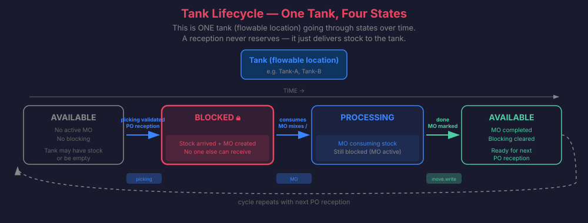
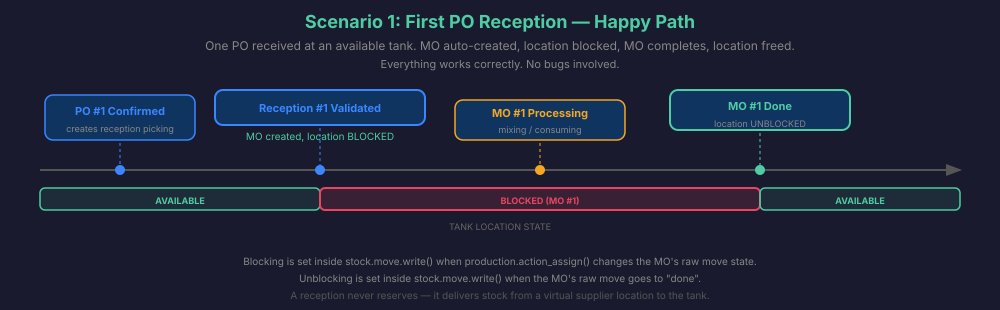
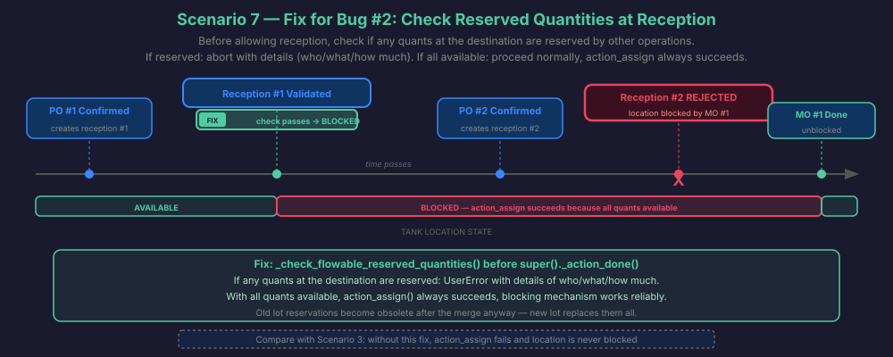
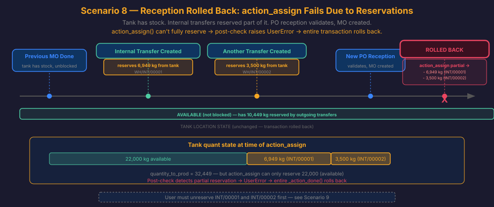
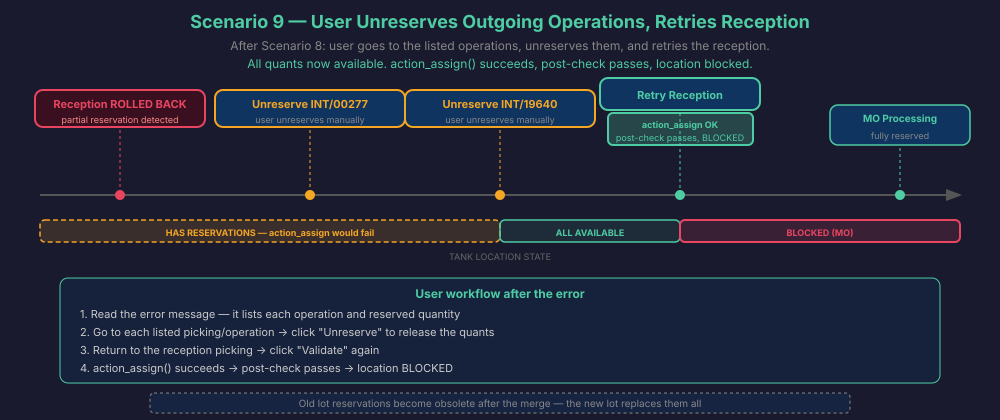
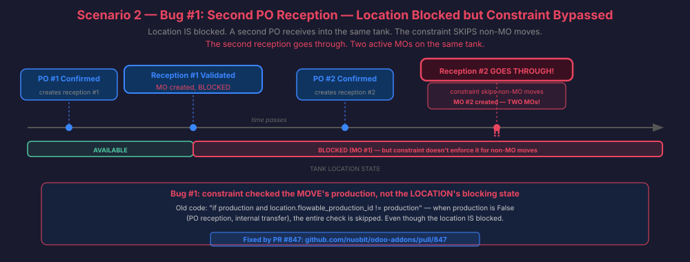
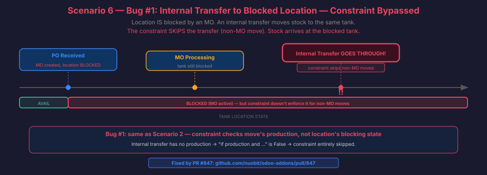
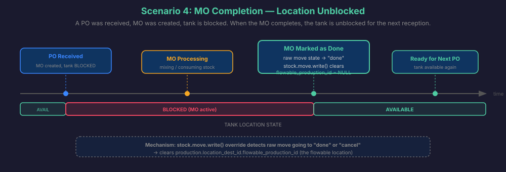
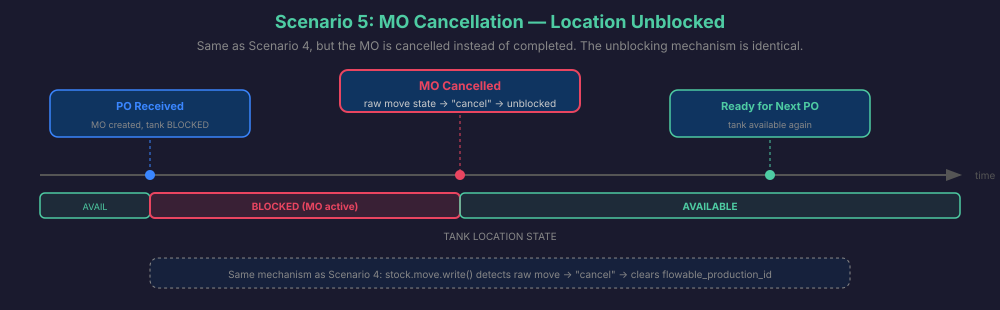

# Flowable Location Blocking Mechanism

How the blocking mechanism works for flowable locations (tanks): lifecycle, concepts,
and scenarios.

---

## 1. Key Concepts

### 1.1 What is a flowable location?

A physical tank (e.g. R5355BBR, Deposito LOX-14). Identified by
`flowable_storage = True` on `stock.location`. It holds liquid/bulk material tracked by
lot.

### 1.2 Tank lifecycle

A tank goes through a repeating cycle:

**Available → Reception fills it → Blocked (MO merges) → MO done → Available**

The tank is "occupied" the moment new material is poured in. While the MO processes the
merge, nobody else should deliver to that tank.



### 1.3 Blocking vs reservation

These are two independent concepts:

- **Blocking** (`flowable_production_id` on `stock.location`): a physical constraint —
  "this tank is in use, nobody should pour more material in." It's about physical
  occupation. Binary: either blocked or not.

- **Reservation** (`reserved_quantity` on `stock.quant`): an Odoo inventory mechanism —
  "these quants are spoken for by a specific stock move." Multiple operations can
  partially reserve quants at the same location simultaneously.

A tank can be **available (not blocked) but have reserved quants** — this is the normal
case when outgoing operations (sales, internal transfers) have reserved material for
delivery.

### 1.4 Partial reservation on a tank

Whether partial reservation makes sense depends on the direction:

- **Outgoing** (sales, internal transfers): **valid**. You can sell 3,500 kg from a
  35,000 kg tank. The sale reserves those 3,500 kg, the rest remains available for other
  sales.

- **Incoming** (receptions/merges): **invalid**. When new material arrives and a merge
  MO is created, the MO must process the **entire** tank content (old + new). If some
  quants are reserved by outgoing operations, the MO cannot reserve the full amount.

### 1.5 Why lot reservations become obsolete after a merge

This is a critical concept. Consider a tank with lot `M251229K` (50,000 kg):

1. Sales SO/123 and SO/456 each reserve 5,000 kg of lot `M251229K`
2. A new PO reception arrives — merge MO is created
3. The MO consumes ALL quants (including `M251229K`) and produces a **new lot**
   `M260219J` (55,000 kg = old 50,000 + new 5,000)
4. Lot `M251229K` still exists in the database but has **zero stock**
5. The reservations by SO/123 and SO/456 for lot `M251229K` are now **unfulfillable** —
   the lot has no stock to deliver

The reservations were already broken the moment the merge happened. This is why the
system forces the user to deal with existing reservations **before** the merge: those
reservations will become invalid anyway, so the user must consciously decide what to do
(unreserve, cancel, or reassign).

### 1.6 How blocking fields work

On `stock.location`:

- **`flowable_production_id`** (Many2one → `mrp.production`): the MO that has blocked
  this location. Set by `stock.move.write()` when `action_assign()` transitions a raw
  move to `assigned`/`partially_available`. Cleared when the raw move goes to `done` or
  `cancel`.

- **`flowable_blocked`** (Boolean, computed, not stored):
  `bool(flowable_storage and flowable_production_id)`. Convenience field — the real data
  is `flowable_production_id`.

The `not flowable_blocked` guard in `stock.move.write()` prevents a new MO from
overwriting an existing `flowable_production_id`.

### 1.7 The reservation post-check in action_assign

`action_assign()` is overridden in `mrp.production`. After `super()`, for flowable
operations it verifies all raw moves are in `assigned` state. If not, it searches for
who holds reservations at the source location and raises `UserError` with details. Since
this runs inside `_action_done()`, the `UserError` rolls back the entire transaction —
no stock moved, no MO persisted.

This is a post-check (EAFP pattern): try the operation, verify the result, roll back if
it failed. Advantages:

- **No concurrency window**: checks the actual result, not a prediction
- **Transaction safe**: `UserError` inside `_action_done` rolls back everything
- **Universal**: any caller of `action_assign()` on a flowable MO gets the check

---

## 2. Scenarios

### Scenario 1: Reception to Empty Tank — Happy Path

Tank R5355BBR is available and empty. A PO reception validates.

1. `_action_done()` runs — stock moves to the tank
2. Merge MO is created with `quantity_to_prod = sum(all quants)`
3. `action_assign()` reserves all quants — succeeds (nothing else reserved)
4. Post-check passes (all raw moves in `assigned` state)
5. `stock.move.write()` sets `flowable_production_id` → **location BLOCKED**



### Scenario 2: Reception with No Outgoing Reservations — Happy Path

Tank Deposito LOX-14 has 32,000 kg from a previous merge. No outgoing operations have
reserved anything. A new PO reception validates.

Same flow as Scenario 1: `action_assign()` reserves all 37,000 kg (old + new),
post-check passes, location blocked. This is the normal case when there are no pending
deliveries from the tank.



### Scenario 3: Reception with Sale/Transfer Reservations — Error and Rollback

Tank Deposito LOX-14 has 32,449 kg of lot `M240815A`. Two outgoing operations have
reserved part of it:

- Sale SO/789 → delivery OSWBU/OUT/01234: reserved 6,949 kg of `M240815A`
- Internal transfer OSWSC/INT/19640: reserved 3,500 kg of `M240815A`

Available: 22,000 kg. A new PO reception validates:

1. `_action_done()` runs — stock moves to the tank (now 37,449 kg total)
2. Merge MO created with `quantity_to_prod = 37,449` (sum of ALL quants)
3. `action_assign()` tries to reserve 37,449 but only 27,000 available
4. Raw move stays `confirmed` (not `assigned`)
5. **Post-check detects partial reservation** → `UserError`:

   ```
   Cannot fully reserve flowable location 'Deposito LOX-14' because there
   are other reserved quantities. All stock must be available before merging.

   The following operations have reservations that must be unreserved first:

     - Product X: 6,949.17 kg — OSWBU/OUT/01234 (Delivery Orders)
     - Product X: 3,500.00 kg — OSWSC/INT/19640 (Internal Transfers)
   ```

6. **Entire transaction rolls back**: no stock moved, no MO created

The error tells the user exactly which operations to fix. The user knows these
reservations are for lot `M240815A`, which will cease to exist after the merge anyway
(see [1.5](#15-why-lot-reservations-become-obsolete-after-a-merge)).



### Scenario 4: User Unreserves and Retries — Success

After Scenario 3, the user:

1. Reads the error — sees the delivery and internal transfer holding reservations
2. Goes to OSWBU/OUT/01234 → clicks "Unreserve" (releases 6,949 kg)
3. Goes to OSWSC/INT/19640 → clicks "Unreserve" (releases 3,500 kg)
4. Returns to the PO reception → clicks "Validate" again
5. `action_assign()` succeeds — all quants available → **location BLOCKED**

After the merge completes, lot `M240815A` has zero stock and a new lot exists. The user
can then re-reserve the deliveries with the new lot if needed.



### Scenario 5: Second Reception to Blocked Location — Correctly Rejected

Location is blocked by an active MO. A second PO reception tries to validate to the same
tank. The constraint `_check_flowable_location_blocked` on `stock.move.line` detects
`flowable_production_id` is set and the current move doesn't belong to that MO →
`ValidationError`. Reception rejected.

This also applies to internal transfers — any move to a blocked location is rejected
regardless of origin.




### Scenario 6: MO Completion — Unblocking

MO finishes processing. The raw move goes to `done`. `stock.move.write()` detects the
state change and clears `flowable_production_id`. Location is available again for the
next reception.



### Scenario 7: MO Cancellation — Unblocking

Same mechanism as completion. `stock.move.write()` clears `flowable_production_id` when
the raw move goes to `cancel`.



---

## 3. Historical Reference: Customer Case R5355BBR

Two PO receptions were validated to the same tank, creating duplicate MOs:

| MO             | Picking        | Origin   | Created    |
| -------------- | -------------- | -------- | ---------- |
| OSWBU/TANK/310 | OSWBU/IN/02260 | PO/21540 | 2026-01-12 |
| OSWBU/TANK/321 | OSWBU/IN/02318 | PO/22188 | 2026-02-24 |

MO 310's `action_assign()` failed (0 available quants — all reserved by other
operations) → location never blocked → 43 days later PO/22188 received into the same
tank unimpeded.

Two issues contributed:

1. The blocked-location constraint in `stock_move_line.py` skipped non-MO moves, so even
   blocked locations weren't protected from PO receptions
2. `action_assign()` failed silently when quants were partially reserved, leaving the
   location unblocked

Both are now fixed:

1. The constraint checks `location.flowable_production_id` directly — any move to a
   blocked location is rejected
2. The `action_assign()` override detects failed reservations and raises `UserError`
   with details, rolling back the transaction

---

## 4. Future Improvements

- **Auto-unreserve on reception**: Instead of requiring manual unreservation,
  automatically unreserve outgoing operations when receiving at a flowable location.
  Deferred to observe how the manual approach works in production first —
  auto-unreserving could disrupt planned deliveries without the user being aware.

---

## 5. Validation Queries

```sql
-- Check current state of a flowable location:
SELECT id, name, flowable_production_id, flowable_storage
FROM stock_location WHERE id = <location_id>;

-- Check active MOs on a flowable location:
SELECT mp.id, mp.name, mp.state, sp.name as picking, mp.create_date
FROM mrp_production mp
LEFT JOIN stock_picking sp ON sp.id = mp.picking_id
WHERE mp.location_src_id = <location_id>
  AND mp.state NOT IN ('done', 'cancel');

-- Check reserved quantities at all flowable locations:
SELECT sl.name as location,
       round(COALESCE(SUM(sq.quantity), 0)::numeric, 2) as total_qty,
       round(COALESCE(SUM(sq.reserved_quantity), 0)::numeric, 2) as reserved,
       round((COALESCE(SUM(sq.quantity), 0)
              - COALESCE(SUM(sq.reserved_quantity), 0))::numeric, 2) as available
FROM stock_location sl
LEFT JOIN stock_quant sq ON sq.location_id = sl.id AND sq.quantity > 0
WHERE sl.flowable_storage = true
GROUP BY sl.id, sl.name
HAVING COALESCE(SUM(sq.reserved_quantity), 0) > 0
ORDER BY sl.name;

-- Check who is reserving at a specific flowable location:
SELECT sml.product_uom_qty as reserved,
       pp.default_code as product,
       sm.reference,
       sp.name as picking,
       mp.name as mo
FROM stock_move_line sml
JOIN stock_move sm ON sm.id = sml.move_id
JOIN product_product pp ON pp.id = sml.product_id
LEFT JOIN stock_picking sp ON sp.id = sm.picking_id
LEFT JOIN mrp_production mp ON mp.id = sm.raw_material_production_id
WHERE sml.location_id = <location_id>
  AND sml.product_uom_qty > 0
  AND sm.state NOT IN ('done', 'cancel', 'draft');
```
